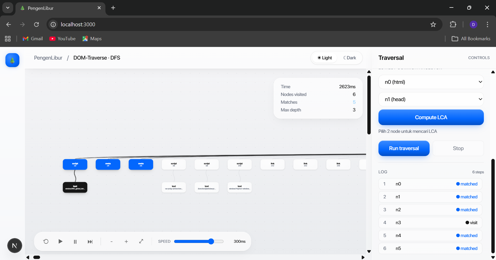
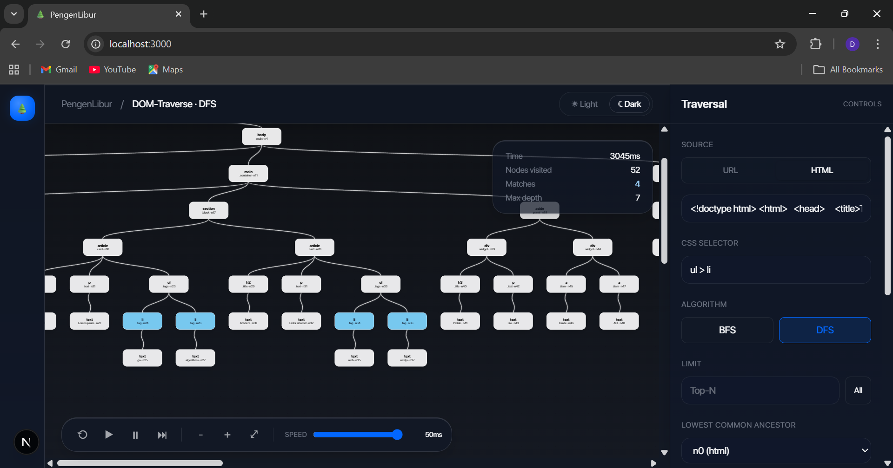

# Tubes2_PengenLibur_FE

## Deskripsi Program
Tubes2_PengenLibur_FE adalah aplikasi frontend untuk melihat proses pencarian pada tree DOM. Aplikasi ini menampilkan HTML dalam bentuk tree, lalu memperlihatkan proses BFS, DFS, dan pencarian LCA dengan tampilan yang interaktif dan menarik.

Aplikasi ini terhubung dengan backend berikut:

- [Tubes2_PengenLibur_BE](https://github.com/ethj0r/Tubes2_PengenLibur_BE)

## Fitur - Fitur

| No. | Fitur | Deskripsi |
|---|---|---|
| 1 | BFS | Menelusuri tree secara bertahap dari level atas ke level bawah |
| 2 | DFS | Menelusuri tree sedalam mungkin sebelum pindah ke cabang lain |
| 3 | Selector Search | Mencari elemen berdasarkan selector seperti tag, class, id, dan kombinasi selector |
| 4 | Traversal Log | Menampilkan urutan node yang dikunjungi dan node yang cocok |
| 5 | LCA | Mencari Lowest Common Ancestor dari dua node yang dipilih |
| 6 | Live Visualization | Menampilkan proses traversal secara visual di layar |

## Syarat Menjalankan Program

Sebelum menjalankan project, pastikan program berikut sudah terpasang:

| No. | Required Program | Link Referensi |
|---|---|---|
| 1 | Node.js | [Node.js](https://nodejs.org/) |
| 2 | npm | [npm](https://www.npmjs.com/) |
| 3 | Docker | [Docker](https://www.docker.com/) |
| 4 | ESlint | [ESlint](https://eslint.org/)

## Cara Menjalankan Program

Ada dua cara untuk menjalankan program ini.

### Opsi Pertama

1. Clone repository ini.

```bash
git clone https://github.com/ethj0r/Tubes2_PengenLibur_FE.git
```

2. Masuk ke folder project.

3. Install dependency yang dibutuhkan.

```bash
npm install
```

4. Jalankan development server.

```bash
npm run dev
```

5. Buka aplikasi di browser.

```text
http://localhost:3000
```

Pastikan backend tersedia di `http://localhost:8080`.

### Opsi Kedua

Jalankan aplikasi dengan Docker Compose.

```bash
docker compose up --build
```
## Screenshots




## Kontributor
| NIM | Nama |
|---|---|
| 13524026 | Made Branenda Jordhy |
| 13524030 | Irvin Tandiarrang Sumual |
| 13524104 | Valentino Daniel Kusumo |